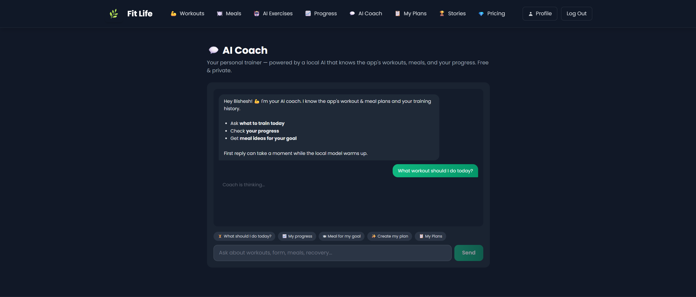
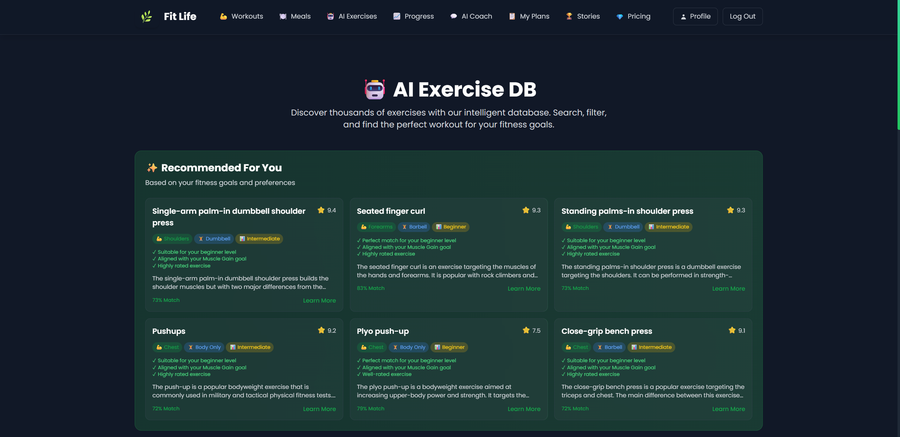
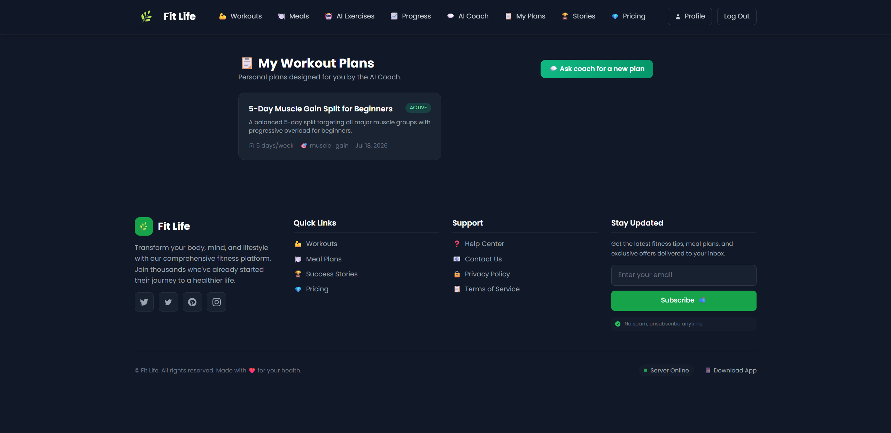

# FitLife 💪 — AI-Powered Fitness Tracking Platform

A full-featured Django fitness platform with a **local-LLM AI coach**, hybrid
ML workout recommendations, progress analytics, meal plans, subscriptions with
eSewa payments, and AI-generated personal workout plans — all AI running
**100% locally via Ollama** (free, private, no API keys).

## Features

**For users**
- Workout & meal plan library with reviews, ratings and detail pages
- 💬 **AI Coach** — chat with a local LLM that knows the app's real workout/meal
  database and your training history (tool-calling agent)
- ✨ **AI-generated personal workout plans** — the coach designs a day-by-day
  plan around your goal, level, frequency and injuries, saved to **My Plans**
- 📈 **Progress dashboard** — streaks, weekly charts, personal bests,
  favourite plans (Chart.js)
- 🤖 **AI Exercises** — hybrid recommender (TF-IDF content-based +
  collaborative filtering from similar users' workout history) over a
  2,900-exercise dataset
- AI meal recommendations personalized to profile & diet preference
- Success stories, subscriptions (eSewa payment integration), email
  verification, password reset

**Engineering highlights**
- Local LLM agent with function/tool calling (Ollama + qwen3:8b) — three tools
  grounded in live database queries, plus structured-output plan generation
- Hybrid recommendation engine (content + collaborative)
- Custom user model, role decorators, multi-step registration
- Secrets in `.env` (python-dotenv), never in code

## Stack
Django 5.1 · SQLite · Ollama (qwen3:8b) · scikit-learn/pandas · Tailwind CSS ·
Chart.js · eSewa payments · Jazzmin admin

## Setup

```bash
# 1. clone & install
git clone https://github.com/bisheshcodes999/FItLife---AI-Powered-Fitness-Website.git
cd FItLife---AI-Powered-Fitness-Website
python -m venv venv
venv\Scripts\activate        # Linux/Mac: source venv/bin/activate
pip install -r requirements.txt


# 2. local AI (one-time, optional but recommended)
# install Ollama from https://ollama.com, then:
ollama pull qwen3:8b

# 4. database & seed data
python manage.py migrate
python manage.py populate_exercises
python manage.py seed_data
python manage.py fetch_images        # downloads workout/meal images
python manage.py createsuperuser

# 5. run
python manage.py runserver           # http://127.0.0.1:8000
```

Without Ollama running, AI features fall back gracefully (popular picks
instead of personalized ones).

## Project structure

```
main_app/            Django project settings & urls
user_app/
  models.py          CustomUser, WorkoutPlan, MealPlan, PersonalWorkoutPlan,
                     WorkoutHistory, UserExerciseProgress, payments, stories
  chatbot.py         AI Coach agent (Ollama tool-calling)
  llm_recommendations.py   local-LLM meal recommendations
  ml_recommendations.py    hybrid workout recommender (TF-IDF + collaborative)
  views/             auth, main views, progress, coach, plans
  templates/         Tailwind UI
  management/commands/     seed_data, populate_exercises, fetch_images
data/megaGymDataset.csv    2,900-exercise dataset
```

## Screenshots

### 💬 AI Coach — local-LLM personal trainer


### 🤖 AI Exercise DB — hybrid recommendations with match scores


### 📋 My Plans — AI-generated personal workout plans


## License
MIT — see [LICENSE](LICENSE).
